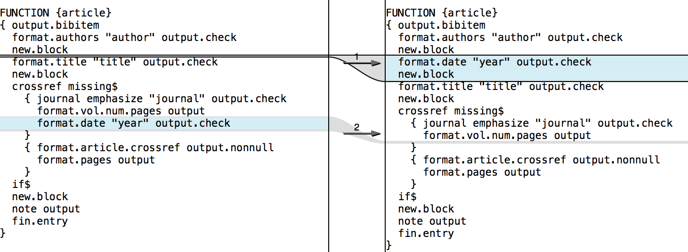
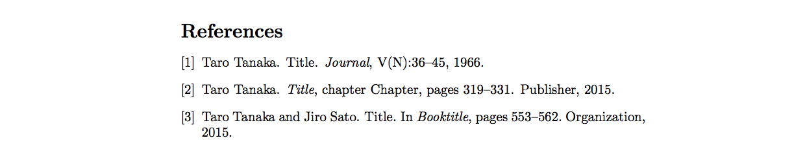

# bst_sample

It's to show sample bib style.

* [Bibtex bibliography styles - ShareLaTeX, Online LaTeX Editor](https://www.sharelatex.com/learn/Bibtex_bibliography_styles)

## Custom Bib Style

This is the difference between [`plain-origin`](./plain-origin/) and [`plain-customized`](./plain-customized/).

* [BibTeXの使い方／参考文献の形式を変更するお（bstファイルの編集） - けつあご日記](http://www.ketsuago.com/entry/2015/03/16/231806)
* [bst ファイルのカスタマイズ - Okomeda Net](http://www.okomeda.net/?bst%20%E3%83%95%E3%82%A1%E3%82%A4%E3%83%AB%E3%81%AE%E3%82%AB%E3%82%B9%E3%82%BF%E3%83%9E%E3%82%A4%E3%82%BA)

### Diff bst

### Diff PDF

## 文献の種類

* [LaTeX(文献の参照BibTeXの書き方)](http://akita-nct.jp/yamamoto/comp/latex/bibtex/bibtex.html)
* [technical report citation in bibtex - TeX - LaTeX Stack Exchange](http://tex.stackexchange.com/questions/160459/technical-report-citation-in-bibtex)
